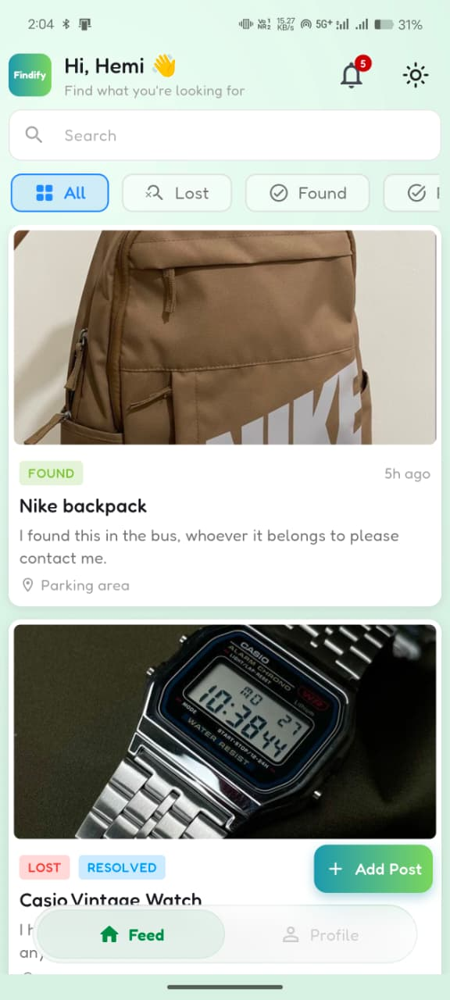
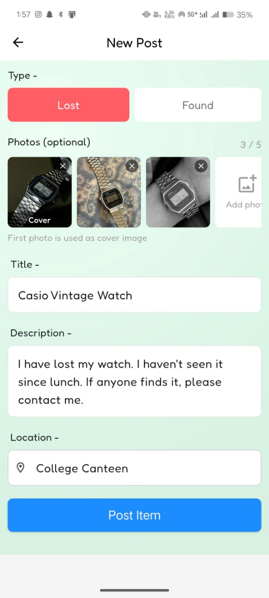
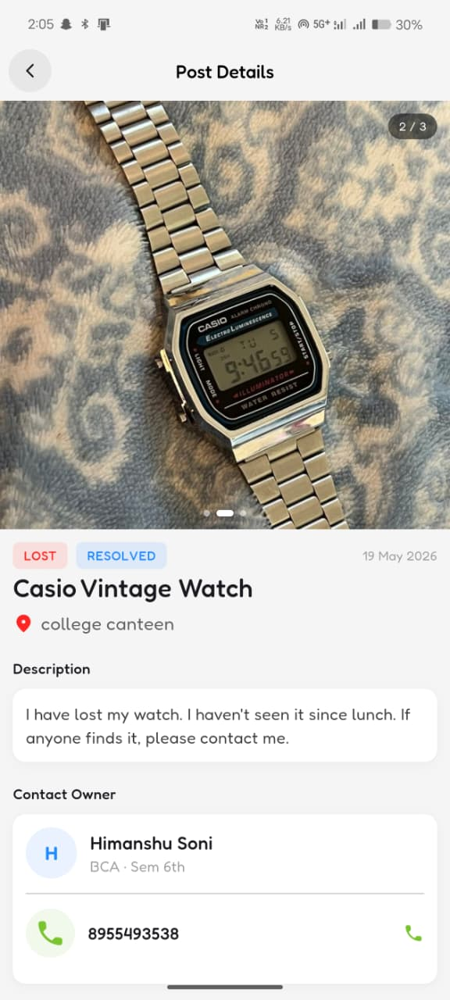
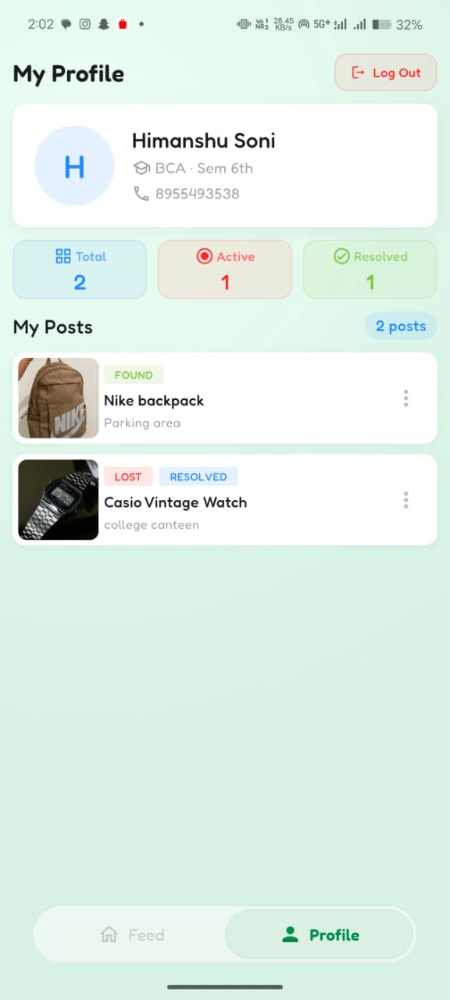

# Findify — Lost & Found App

A full-stack mobile application built for college environments where students can report lost or found items and connect with each other to recover them.

> Built with Flutter + Supabase (REST API only) as a portfolio project.

---

## Screenshots

<!-- Add screenshots after running the app -->
| Feed | Add Post | Post Detail | Profile |
|------|----------|-------------|---------|
|  |  |  |  |

---

## Features

- **Authentication** — Email/password signup & login via Supabase Auth (JWT)
- **Lost & Found Feed** — Browse all posts with real-time search and Lost/Found filter
- **Create Posts** — Upload item photo from camera or gallery, add location and description
- **Post Detail** — View full item info and contact the owner directly
- **Mark Resolved** — Owner can mark their item as recovered
- **Profile Screen** — View your posts, stats, and manage or delete them
- **Dark Mode** — Follows system theme automatically
- **Persistent Login** — JWT token stored locally, auto-login on relaunch

---

## Tech Stack

| Layer | Technology |
|---|---|
| Frontend | Flutter (Dart) |
| State Management | GetX |
| Backend | Supabase (REST API only — no SDK) |
| Database | PostgreSQL via Supabase |
| Auth | Supabase Auth (JWT) |
| Storage | Supabase Storage (image upload) |
| Local Storage | shared_preferences |

---

## Project Structure

```
lib/
├── core/
│   ├── app_theme.dart        # Light & dark theme definitions
│   ├── api_client.dart       # HTTP wrapper (GET/POST/PATCH/DELETE + JWT)
│   ├── constants.dart        # Supabase URL, endpoints
│   └── storage_service.dart  # JWT token persistence
├── controllers/
│   ├── auth_controller.dart  # Signup, login, logout, auto-login
│   └── post_controller.dart  # Fetch, create, filter, search, delete
├── models/
│   ├── user_model.dart
│   └── post_model.dart
└── screens/
    ├── splash_screen.dart
    ├── login_screen.dart
    ├── signup_screen.dart
    ├── home_screen.dart
    ├── add_post_screen.dart
    ├── post_detail_screen.dart
    ├── profile_screen.dart
    └── widgets/
        ├── post_card.dart
        ├── my_post_card.dart
        ├── filter_bar.dart
        └── skeleton_loader.dart
```

---

## Database Schema

### `profiles`
| Column | Type | Notes |
|---|---|---|
| id | UUID | References auth.users |
| name | TEXT | |
| course | TEXT | |
| semester | TEXT | |
| phone | TEXT | |

### `posts`
| Column | Type | Notes |
|---|---|---|
| id | UUID | Primary key |
| user_id | UUID | References auth.users |
| title | TEXT | |
| description | TEXT | |
| type | TEXT | `lost` or `found` |
| location | TEXT | |
| image_url | TEXT | Supabase Storage public URL |
| is_resolved | BOOLEAN | Default false |
| created_at | TIMESTAMP | |

Row Level Security is enabled on both tables — users can only modify their own data.

---

## Getting Started

### Prerequisites
- Flutter SDK ≥ 3.0
- A free [Supabase](https://supabase.com) account

### Setup

1. **Clone the repo**
```bash
   git clone https://github.com/YOUR_USERNAME/findify.git
   cd findify
```

2. **Install dependencies**
```bash
   flutter pub get
```

3. **Configure Supabase**

   Open `lib/core/constants.dart` and fill in your project credentials:
```dart
   static const String supabaseUrl = 'YOUR_SUPABASE_URL';
   static const String supabaseAnonKey = 'YOUR_SUPABASE_ANON_KEY';
```

4. **Set up the database**

   Run the SQL from the [Database Schema](#database-schema) section in your Supabase SQL Editor. Enable RLS and add the policies described in the project docs.

5. **Run the app**
```bash
   flutter run
```

---

## Security

- Row Level Security (RLS) enforced in Supabase — users can only edit/delete their own posts and profiles
- JWT tokens stored locally via `shared_preferences`, sent as `Authorization: Bearer` headers on every authenticated request
- Input validated on the frontend before any API call is made

---

## Future Scope

- In-app messaging between users
- Multi-college support with college verification
- Admin panel to moderate spam posts
- Push notifications when someone contacts you
- Item category tags (Electronics, Books, ID Cards, etc.)

---

## Author

**Himanshu Soni**
- GitHub: [himanshusoni0516](https://github.com/himanshuSoni0516)
- LinkedIn: [Himanshu Soni](https://www.linkedin.com/in/himanshusoni0516/)

---

*Built as a portfolio project to demonstrate full-stack Flutter development with REST API integration.*